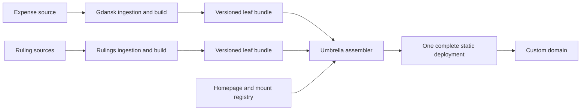

**Static publishing pipelines for an umbrella domain**

Research checked 10 September 2026 against primary sources. Prices are USD, excluding tax and domain registration. This is a design proposal; no repositories, hosting accounts, or deployments were changed.

My recommendation is **separate leaf repositories → versioned static bundles → one assembly repository → one static deployment**. Use GitHub Actions for ingestion and builds. Cloudflare Workers Static Assets is my preferred hosting target for a new project with uncertain growth; GitHub Pages is a reasonable first target if keeping everything on GitHub matters more. Keep the assembled output portable between them.

I interpret “updated as a whole” as one release containing the homepage and every leaf. The scope of the court-rulings collection is undecided, so the design allows its corpus to grow separately from the website bundle. This interpretation is the reason for central assembly. If only the homepage needs whole-page replacement and leaves may deploy independently, the alternative near the end becomes attractive.

GitHub Pages shares a user/organization site's custom domain with its project sites at `domain/<repository>`. That is not a configurable mapping from arbitrary repositories to arbitrary nested paths. For the requested URLs, assembling directories in a single deployment provides the missing mapping. This conclusion follows from GitHub's documented URL scheme. [GitHub custom-domain behavior](https://docs.github.com/en/pages/configuring-a-custom-domain-for-your-github-pages-site/about-custom-domains-and-github-pages#using-a-custom-domain-across-multiple-repositories).

The repository layout can remain simple:

```text
umbrella-site                 Homepage, section indexes, mount registry, assembler, deploy
gdansk-rejestr-wydatkow        Expense acquisition, normalization, presentation, leaf build
nsa-publikacja-orzeczen        Ruling acquisition, normalization, presentation, leaf build
```

The publishing repository creates this complete directory tree:

```text
dist/
  index.html
  404.html
  robots.txt
  sitemap.xml
  site-version.json
  gdansk/
    index.html
    rejestr-wydatkow/
      index.html
      assets/...
      data/...
  nsa/
    index.html
    publikacja-orzeczen/
      index.html
      assets/...
      data/...
```

Repository names and public paths are independent. A small registry in `umbrella-site` maps them. These are illustrative configuration fields, not a supplied implementation:

```yaml
leaves:
  - id: gdansk-expenses
    repository: OWNER/gdansk-rejestr-wydatkow
    mount: /gdansk/rejestr-wydatkow/
  - id: administrative-rulings
    repository: OWNER/nsa-publikacja-orzeczen
    mount: /nsa/publikacja-orzeczen/
```

Each leaf accepts its mount as `BASE_PATH` at build time. Its bundle contains `index.html`, assets and any small data files, relative to the leaf root. The assembler adds the mount directories exactly once. Assets, links, canonical URLs and browser data requests must respect that prefix. Reserve the homepage, global navigation, section indexes, root 404 and sitemap for the umbrella repository.

The following pipeline split is my proposed architecture, rather than a requirement of a hosting vendor:

| Pipeline | Trigger | Work | Durable output |
| --- | --- | --- | --- |
| Acquire and normalize, per leaf | Source-appropriate schedule; manual backfill | Incremental download, parse, validate, deduplicate, record corrections and provenance | Versioned dataset plus checkpoint |
| Build and release, per leaf | Code change or validated data change | Generate HTML, charts, data shards and search index; check links beneath the mount | Static bundle plus release metadata |
| Assemble and publish, umbrella | Homepage/registry change; scheduled leaf discovery; manual run | Select releases, copy every leaf into a clean tree, generate navigation, validate, deploy | Complete site bundle plus locked release manifest |
| Check freshness and availability | After deploy; independent periodic check if freshness becomes critical | Verify deployed version and representative paths; compare source timestamps against expected cadence | Actionable failure or freshness signal |



**Build only changed leaves; release the full tree.** A new Gdansk dataset should not recrawl or rebuild the rulings collection. It produces a new Gdansk bundle. The assembler combines that with the existing rulings bundle and regenerates small global files. Assembly still transfers and validates data, so its cost grows with the complete output; it is cheaper than repeating ingestion and rendering, not costless.

For ingestion, retain the source URL, fetched timestamp, upstream identifier, raw-content hash and parser version. Use checkpoints plus a bounded lookback to catch corrected records. Skip content builds when normalized data and code are unchanged. Keep operational “last checked” timestamps separate from content hashes so checking an unchanged source does not force a new site release. A fetch error, changed schema or unexpectedly empty dataset should fail validation and leave the previous public release available.

For release storage, start with modest versioned GitHub Release bundles for the generated site outputs. Releases support attached binary assets; individual assets must be below 2 GiB. [GitHub releases](https://docs.github.com/en/repositories/releasing-projects-on-github/about-releases). Store large raw archives in object storage as the corpus grows. GitHub Actions artifacts are suitable for passing files between jobs, but their default retention is 90 days; they should not be the only copy of the last working leaf release. [Artifact retention](https://docs.github.com/en/actions/how-tos/manage-workflow-runs/download-workflow-artifacts).

A leaf's metadata should identify its repository, source commit, dataset version, mount path, bundle SHA-256, byte size, file count, largest file, record count and data-as-of timestamp. Pin the selected values into a `site.lock.json` for each assembled release. Select all versions once at the start of assembly; do not repeatedly fetch a changing `latest` alias during that run. Retain the previous complete bundle and lock for rollback, and preserve every leaf bundle referenced by a retained site release.

Start with **central polling**, perhaps hourly at an off-hour minute, plus manual publishing. The umbrella workflow reads release metadata from the public leaf repositories and deploys only when a leaf version or homepage changes. This avoids granting every leaf credentials to update the umbrella repository. If immediate publishing becomes useful, add an explicit cross-repository dispatch with a narrowly scoped GitHub App token. The default `GITHUB_TOKEN` is scoped to its own repository; it is not a cross-repository write credential. A repository dispatch requires target-repository Contents write permission. [Token scope](https://docs.github.com/en/actions/concepts/security/github_token), [dispatch API](https://docs.github.com/en/rest/repos/repos#create-a-repository-dispatch-event).

GitHub schedules can be delayed or dropped under load, and public-repository schedules are disabled after 60 days without repository activity. Treat this as a freshness constraint: expose the actual data timestamp, support manual reruns, and add an external freshness check if missing a publication window becomes unacceptable. [Scheduled workflow behavior](https://docs.github.com/en/actions/reference/workflows-and-actions/events-that-trigger-workflows#schedule). Keep acquisition and its dependent build in the same workflow, or explicitly invoke the next workflow; a commit made with `GITHUB_TOKEN` does not itself trigger a normal push workflow. [Token-trigger behavior](https://docs.github.com/en/actions/concepts/security/github_token#when-github_token-triggers-workflow-runs).

Use one concurrency group for the entire production assembly/publishing workflow, with in-progress deployment cancellation disabled. Resolve current publishable versions after entering that group, so a delayed run does not replace a newer release with an old event payload. Ordinary reconciliation can coalesce pending requests; rollback should be an explicit operation with a chosen lock. GitHub concurrency permits only one active run per group, with one pending run by default. [Concurrency documentation](https://docs.github.com/en/actions/how-tos/write-workflows/choose-when-workflows-run/control-workflow-concurrency).

Only the umbrella deploy job needs production hosting credentials. Validate bundles before that job: reject overlapping mounts, files escaping their mount, unsafe archive entries, missing indexes, wrong asset prefixes and unexpected size growth. Link checks should exercise both deep URLs and their assets. Use content-hashed filenames and retain recently referenced assets for a grace period where practical: one deployment does not guarantee that every browser and CDN cache switches all of its requests simultaneously.

On GitHub Pages, upload the **entire** assembled directory through `actions/upload-pages-artifact`, then deploy it through `actions/deploy-pages`. The deploy job needs `pages: write`, `id-token: write` and the Pages environment. Configure the domain on this publishing repository. Do not have leaf jobs independently deploy partial directory trees to the same target. [GitHub custom deployment workflows](https://docs.github.com/en/pages/getting-started-with-github-pages/using-custom-workflows-with-github-pages).

On Cloudflare, deploy the same directory as Workers Static Assets. A static-only configuration needs an assets directory and no Worker script. Cloudflare currently recommends Workers for new projects while continuing to support Pages. A Workers Custom Domain requires an active Cloudflare zone, so this choice also means adopting Cloudflare's domain/DNS setup. [Cloudflare static-site guidance](https://developers.cloudflare.com/workers/best-practices/workers-best-practices/#use-workers-static-assets-for-new-projects), [Custom Domains](https://developers.cloudflare.com/workers/configuration/routing/custom-domains/).

**Hosting comparison, checked 10 September 2026.**

| Host | Relevant cost and limits | Assessment for this design |
| --- | --- | --- |
| GitHub Pages | Free with public repositories. Published site maximum 1 GB; soft bandwidth limit 100 GB/month; deployment timeout 10 minutes. The soft 10-builds/hour limit is waived for custom Actions publishing, not the size/bandwidth limits. [Limits](https://docs.github.com/en/pages/getting-started-with-github-pages/github-pages-limits) | Simplest GitHub-only start. The whole assembled domain shares the site limit. Civic information publishing fits the proposed use; Pages is not intended for sites primarily facilitating commercial transactions or SaaS. |
| Cloudflare Workers Static Assets | Static requests free/unlimited; no additional asset storage charge. [Asset billing](https://developers.cloudflare.com/workers/static-assets/billing-and-limitations/) 20,000 files Free; 100,000 Paid; 25 MiB/file. [Limits](https://developers.cloudflare.com/workers/platform/limits/) Paid starts at $5/account/month. [Pricing](https://developers.cloudflare.com/workers/platform/pricing/) | Preferred new-project option. Count every file, including search indexes and assets. Optional Worker execution and other services have separate charges. |
| Cloudflare Pages | Free static requests/bandwidth. [Product page](https://www.cloudflare.com/products/pages/) Free: 500 builds/month, one concurrent build, 20-minute timeout, 20,000 files and 25 MiB/file. [Limits](https://developers.cloudflare.com/pages/platform/limits/) | Capable alternative, but Workers is Cloudflare's recommended direction for new projects. The overview says 500 deploys while detailed limits say builds; do not assume direct uploads bypass every publication quota. [Overview](https://developers.cloudflare.com/pages/) |
| Netlify Free, current credit plans | 300 credits/month shared across usage. Each production deploy consumes 15; bandwidth 20/GB; requests 2/10,000. Exhaustion pauses serving. [Credit rules](https://docs.netlify.com/manage/accounts-and-billing/billing/billing-for-credit-based-plans/how-credits-work/) | Weak fit for frequent publishing: 30 daily releases consume 450 credits before traffic. Personal starts at $9/month with 1,000 credits. [Plans](https://www.netlify.com/pricing/) |
| Vercel Hobby | Free for personal, noncommercial use. [Hobby plan](https://vercel.com/docs/plans/hobby) 100 GB Fast Data Transfer; 100 deployments/day; CLI source-upload constraints include 15,000 files and 100 MB on Hobby. Builds on Vercel do not have the same output-file-count restriction. [Limits](https://vercel.com/docs/limits) | Viable for a small eligible site, but less natural for large externally assembled bundles. Public-interest subject matter alone does not establish Hobby eligibility. [Fair use](https://vercel.com/docs/limits/fair-use-guidelines/) |

The delivery layer can start at $0 on GitHub Pages or Workers Static Assets, within the applicable limits. GitHub's standard hosted runners are free for public repositories; private ingestion/build jobs have plan allowances, and Actions storage has separate accounting. Do not interpret free static serving as free unlimited CI or archived datasets. [Actions billing](https://docs.github.com/en/billing/concepts/product-billing/github-actions).

Build on GitHub and upload the final directory to Cloudflare using its supported external CI workflow. Cloudflare's own Workers Builds is another option with separate build quotas, but is unnecessary for this design. [External CI deployment](https://developers.cloudflare.com/workers/ci-cd/external-cicd/github-actions/), [Workers Builds allowances](https://developers.cloudflare.com/workers/ci-cd/builds/limits-and-pricing/).

**Plan for the corpus separately from the interface.** File count and bytes are independent constraints. For illustration, 100,000 generated pages averaging 20 KB consume about 2 GB before assets or search indexes: too large for GitHub Pages and beyond Cloudflare Free's file count. This is an example calculation, not an estimate of the actual court dataset.

Keep the initial site focused on HTML pages, summaries, indexes and modest data shards. When the corpus grows, publish immutable documents and larger shards to `data.<domain>` in object storage. The user-facing leaf stays at `/nsa/publikacja-orzeczen/`. Upload referenced objects first, then deploy a site manifest that pins them; retain objects referenced by older retained site releases. Prefer content-addressed unchanged objects over duplicating the entire corpus for every snapshot.

Cloudflare R2 Standard includes 10 GB-month of storage, 1 million Class A and 10 million Class B operations monthly. Above that, storage is $0.015/GB-month, Class A $4.50/million and Class B $0.36/million; direct egress is free. For example, 100 GB retained for a full month is approximately $1.35 in storage if the entire free storage allowance is available, with operations and any Worker execution additional. [R2 pricing](https://developers.cloudflare.com/r2/pricing/).

Use an R2 custom domain for production. The `r2.dev` endpoint is rate-limited and intended for development. Configure cache rules for the file types you serve, and CORS when browser code on the main domain fetches data from the data subdomain. [R2 public buckets](https://developers.cloudflare.com/r2/buckets/public-buckets/), [R2 CORS](https://developers.cloudflare.com/r2/buckets/cors/).

If every ruling must eventually have an indexable HTML URL on the main hostname and the corpus exceeds the static asset limits, that requires another publishing decision. One option is pre-rendered HTML in object storage served through a small path handler/CDN; it preserves static content but introduces request processing and its costs. A browser application loading shards is cheaper to serve but is not equivalent to publishing a standalone HTML page for each record.

For initial full-text search, evaluate Pagefind against a representative sample. It builds a static, chunked index and searches in the browser. Its stated goal covers sites with tens of thousands of pages; that is not evidence that a complete national corpus will meet your latency and download budget. [Pagefind](https://pagefind.app/). Measure index bytes, fetched bytes per query, browser memory, mobile latency and Polish-language query quality before deciding whether to keep search static, partition it, or introduce a search service.

**If independent publishing becomes more important than a whole-domain release**, Cloudflare offers another useful layout: one static-assets deployment for each leaf, attached to a route such as `domain/gdansk/rejestr-wydatkow/*`, plus a root deployment. Its documentation supports assets on subdirectory routes when the asset directory mirrors the path. This can avoid a custom reverse-proxy script for static asset matches. The trailing-slash entry URL and missing-path behavior need explicit handling. [Subdirectory routing](https://developers.cloudflare.com/workers/static-assets/routing/advanced/serving-a-subdirectory/), [static request handling](https://developers.cloudflare.com/workers/static-assets/).

Those leaves can deploy independently, but updating multiple deployments is no longer a single whole-domain release. I would therefore keep central assembly for the stated requirement. DNS alone cannot select a repository by URL path.

The first implementation should establish the bundle contract using the two example leaves, one registry and one assembler. Measure compressed and uncompressed size, file count, largest file, build duration and the size of representative search queries. As an internal operating margin, flag growth at 70% of the selected host's published limits. These are proposed thresholds, not vendor limits. Introduce object storage when the measured corpus needs it; introduce request-time search only when measured search behavior warrants it.

The hosting choice can then change through a deployment adapter while repository ownership, leaf paths, acquisition pipelines and release manifests remain the same. The major unresolved inputs are acquisition sources and their change cadence, whether full documents will be mirrored, expected traffic, and whether individual ruling pages must be indexed by search engines. No source-access or corpus-size assessment has been performed in this hosting research.
